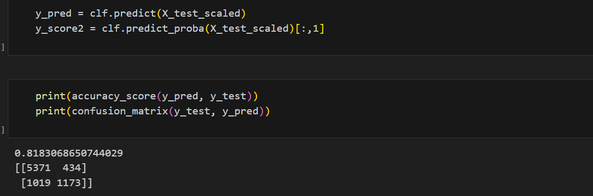
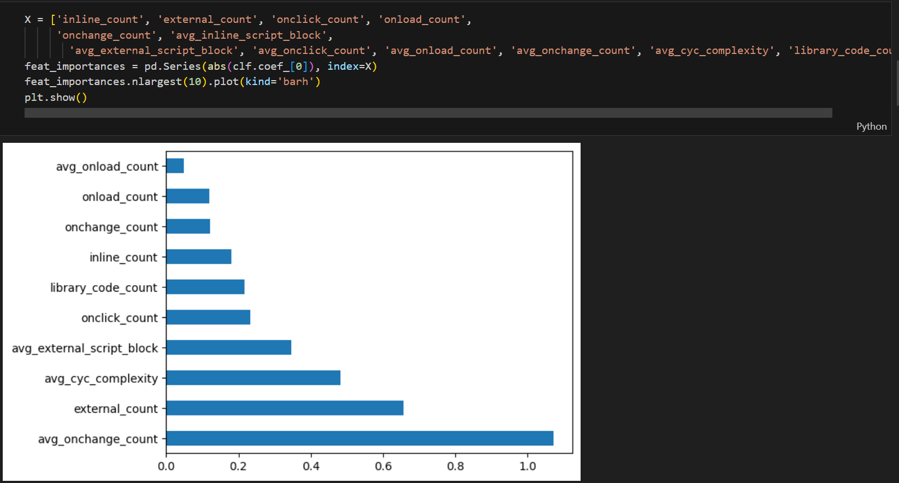
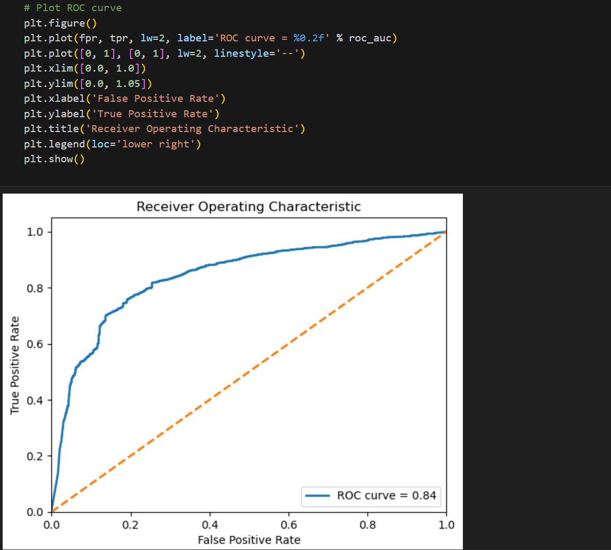
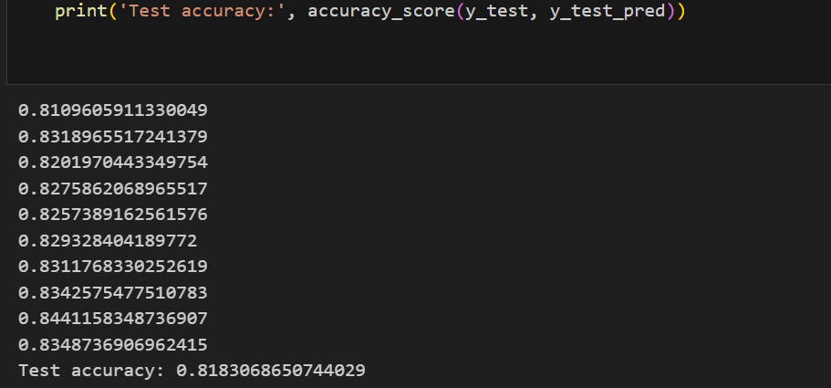

# Machine Learning Phishing Website Classification

# Overview

This project involves building a machine learning classification model to predict phishing websites based on a labeled dataset of phishing and non-phishing websites. The goal is to train a logistic regression classifier, evaluate its performance using a confusion matrix and ROC curve, and analyze feature importance.

# Deliverables

* Jupyter Notebook
* Logistic Regression Classifier Model
* Python

# Dataset

* The target variable is labeled as either "phish" or "alexa" (non-phishing)
* inline_count
* external_count
* onclick_count
* onload_count
* onchange_count
* avg_inline_script_block
* avg_external_script_block
* avg_onclick_count
* avg_onload_count
* avg_onchange_count
* avg_cyc_complexity
* library_code_count
* type (target variable: phish/alexa)

# Logistic Regression Classifier

Used the Logistic Regression classifier to train the model with 33% of the data set aside for testing and the remaining 67% for training. The model is trained to classify emails into either phishing or non-phishing categories.

# Confusion Matrix Evaluation

The model’s performance is evaluated using a confusion matrix, which provides insight into the true positives, true negatives, false positives, and false negatives.

# Feature Analysis

I conducted an analysis to determine which features in the dataset contribute the most to the classification decision. This helps in understanding the model’s decision making process.

# ROC Curve

A Receiver Operating Characteristic (ROC) curve was generated to visualize the classifier's performance, plotting the true positive rate against the false positive rate.

# Full Report Analysis

The Logistic Regression model achieved a ROC AUC score of 0.84, indicating strong classification performance. The ROC curve plots the True Positive Rate (TPR) against the False Positive Rate (FPR). An AUC (Area Under Curve) score of 0.84 suggests that the model can effectively distinguish between phishing and non-phishing websites 84% of the time. 
Overall classification accuracy of the model on the test set was 81%. The algorithm correctly predicted phishing and non-phishing websites with high reliability.

